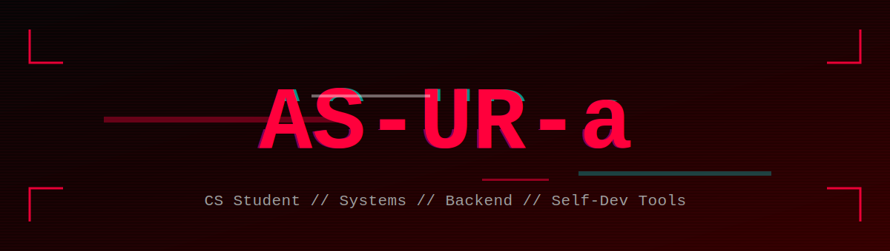

<p align="center">
  
</p>

<p align="center">
  
</p>

<p align="center">
  
</p>

<p align="center">
  
</p>

<br>

<h2 align="center">// PROFILE // CLASSIFIED //</h2>

> *"A happy ending? For folks like us? Wrong city, wrong people."*

I'm a **CS student** running through the stack — fast, reckless, and always reaching higher. Started with **design**, then broke into **frontend** (React, JS, Node.js, HTML/CSS), built **mobile apps with React Native** at hackathons, then went deeper: **hardware**, **operating systems**, wiped Windows, installed **Arch Linux**, and never looked back.

Now I'm building **self-dev tools** — software for learning, growth, and personal systems. Backend is where I'm heading, but I still respect every layer below.

**Current loadout:**
- Building self-development and learning tools
- Backend development
- Studying **Tanenbaum** and operating systems
- Exploring cybersecurity and high-load systems
- Dreaming of a startup that actually changes something

**Languages:** Russian, English

**Mindset:** my programming level isn't maxed yet — but I'm grinding every day. Looking for new people, connections, and projects to run with. If you're building something cool, I want in.

<br>

<h2 align="center">// ARSENAL //</h2>

<p align="center">
  
</p>

<p align="center">
  
  
  
  
  
  
  
</p>

<p align="center">
  
  
  
  
  
  
  
</p>

<p align="center">
  
  
  
</p>

<br>

<h2 align="center">// ACTIVE RUNS //</h2>

<p align="center">
  
</p>

<br>

<h2 align="center">// FEATURED GIGS //</h2>

<table align="center">
  <tr>
    <td style="background-color:#0d1117; border:1px solid #ff003c; border-radius:10px; padding:18px; width:320px;">
      <h3 align="center" style="color:#ff003c; margin-top:0;">🚀 Project Alpha</h3>
      <p align="center" style="color:#c9d1d9;">Self-dev tool for habit tracking and focused learning sessions.</p>
      <p align="center">
        
        
        
      </p>
      <p align="center">
        <a href="https://github.com/AS-UR-a">
          
        </a>
      </p>
    </td>
    <td style="width:20px;"></td>
    <td style="background-color:#0d1117; border:1px solid #ff003c; border-radius:10px; padding:18px; width:320px;">
      <h3 align="center" style="color:#ff003c; margin-top:0;">⚡ Project Beta</h3>
      <p align="center" style="color:#c9d1d9;">Backend service for data processing and real-time analytics.</p>
      <p align="center">
        
        
        
      </p>
      <p align="center">
        <a href="https://github.com/AS-UR-a">
          
        </a>
      </p>
    </td>
  </tr>
</table>

<br>

<h2 align="center">// BREACH PROTOCOL //</h2>

<p align="center">
  
</p>

<p align="center">
  
</p>

```
[SYSTEM] Intrusion attempt detected
[SYSTEM] ICE layer bypassed
[SYSTEM] Password matrix solved
[SYSTEM] Root access acquired
```

<br>

<h2 align="center">// CREW WANTED //</h2>

<p align="center">
  
</p>

<p align="center">
  Looking for a crew to run gigs with. Open to collaborations, side projects,<br>
  hackathons, open-source, startups — anything that pushes the limits.
</p>

<p align="center">
  <strong>If you're building something in the deep grid, hit me up.</strong>
</p>

<br>

<h2 align="center">// METRICS // RAW DATA //</h2>

<p align="center">
  
  
</p>

<p align="center">
  
</p>

<br>

<h2 align="center">// CONNECT // OPEN PORTS //</h2>

<p align="center">
  <a href="https://t.me/YOUR_TELEGRAM">
    
  </a>
  <a href="mailto:your.email@example.com">
    
  </a>
  <a href="https://www.linkedin.com/in/YOUR_LINKEDIN/">
    
  </a>
  <a href="https://twitter.com/YOUR_TWITTER">
    
  </a>
</p>

<br>

<p align="center">
  
</p>
